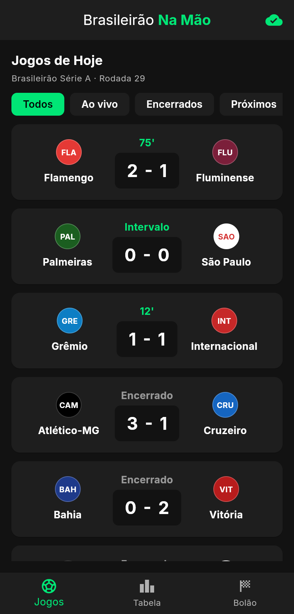
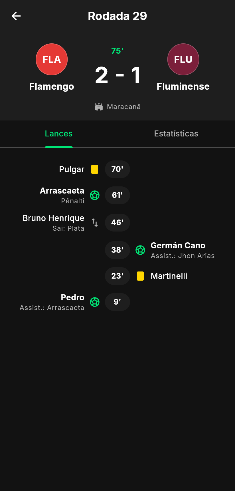
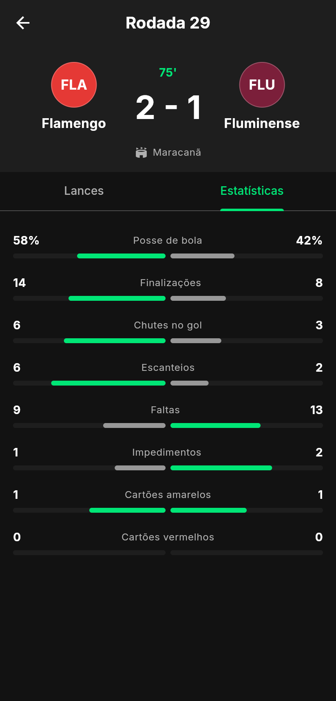
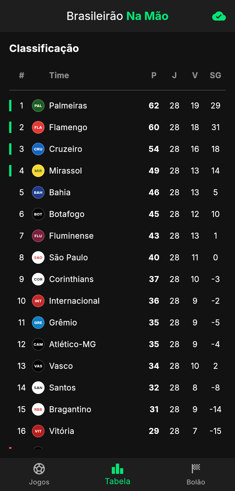
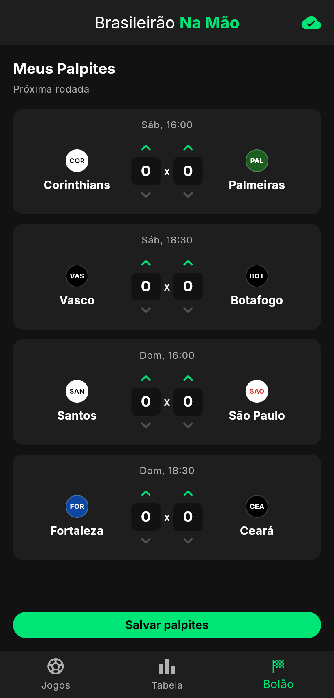
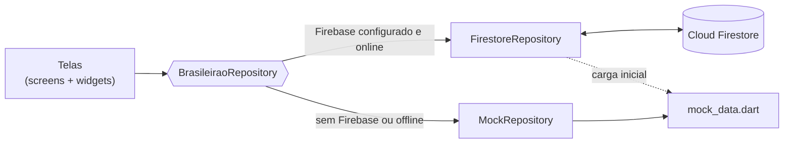

<p align="center">
  
</p>

<h1 align="center">Brasileirão Na Mão</h1>

<p align="center">
  <b>Resultados, estatísticas e bolão do futebol brasileiro na palma da mão.</b>
</p>

<p align="center">
  
  
  
</p>

Projeto integrado da disciplina de Desenvolvimento de Apps (FIAP), construído ao longo dos Checkpoints 4, 5 e 6.

## Sumário

- [Telas](#telas)
- [Proposta de valor](#proposta-de-valor)
- [Funcionalidades (MVP)](#funcionalidades-mvp)
- [Marca e identidade visual](#marca-e-identidade-visual)
- [Pitch e modelo de negócio](#pitch-e-modelo-de-negócio)
- [Como rodar o projeto](#como-rodar-o-projeto)
- [Firebase](#firebase)
- [Arquitetura](#arquitetura)
- [Decisões técnicas](#decisões-técnicas)
- [Andamento por checkpoint](#andamento-por-checkpoint)
- [Integrantes](#integrantes)

## Telas

| Jogos | Partida: lances | Partida: estatísticas | Tabela | Bolão |
|:---:|:---:|:---:|:---:|:---:|
|  |  |  |  |  |

## Proposta de valor

O Brasileirão Na Mão é um aplicativo intuitivo que oferece resultados do futebol brasileiro em tempo real, estatísticas detalhadas de partidas e um bolão entre amigos. O objetivo é permitir que torcedores acompanhem seus times de forma rápida e analítica, em uma interface limpa e moderna.

### O problema que resolvemos

É difícil encontrar dados consolidados (gols, posse de bola, cartões, histórico) de forma rápida durante os jogos. Muitos aplicativos são poluídos visualmente ou lentos, porque tentam cobrir dezenas de esportes e ligas ao mesmo tempo. O Brasileirão Na Mão foca em um único campeonato e na entrega ágil e visualmente agradável da informação.

### Público-alvo

- Torcedores assíduos que acompanham vários jogos simultaneamente.
- Jogadores de *fantasy games* (como o Cartola FC) que precisam de estatísticas de desempenho.
- Analistas esportivos amadores e amantes de estatísticas.
- Grupos de amigos que fazem bolão a cada rodada.

## Funcionalidades (MVP)

| Funcionalidade | Descrição | Status |
|---|---|:---:|
| **Jogos da rodada** | Placar e situação de cada jogo (ao vivo, intervalo, encerrado, agendado), com atualização em tempo real | ✅ |
| **Filtro de jogos** | Todos / Ao vivo / Encerrados / Próximos | ✅ |
| **Detalhes da partida** | Linha do tempo com gols, pênaltis, gols contra, cartões e substituições | ✅ |
| **Estatísticas do jogo** | Posse de bola, finalizações, chutes no gol, escanteios, faltas, impedimentos e cartões | ✅ |
| **Tabela de classificação** | 20 times, com destaque para G4 (Libertadores) e Z4 (rebaixamento) | ✅ |
| **Bolão** | Palpites para a próxima rodada, salvos no Firebase | ✅ |

## Marca e identidade visual

### Nome e naming rationale

O nome **Brasileirão Na Mão** nasce do conhecido Campeonato Brasileiro (*Brasileirão*) e da expressão *"Na Mão"*, que remete a algo prático e fácil de acessar e consultar. O nome foi pensado para ser impactante e fácil de memorizar, e para comunicar na hora o propósito do aplicativo. O logo reforça a ideia: uma mão segurando a bola.

### Tom de voz

Dinâmico e apaixonado (futebolístico), mas objetivo e analítico na apresentação dos dados. Exemplos usados no app: *"Jogos de Hoje"*, *"Meus Palpites"*, *"A partida ainda não começou"*.

### Paleta de cores

| Uso | Cor | Hex |
|---|---|---|
| Fundo (dark mode) |  | `#121212` |
| Cards e barras |  | `#1E1E1E` |
| Destaque / primária |  | `#00E676` |
| Texto principal |  | `#FFFFFF` |
| Texto secundário |  | `#A0A0A0` |
| Rebaixamento / cartão vermelho |  | `#FF5252` |
| Cartão amarelo |  | `#FFD600` |

No código, todas as cores estão centralizadas em [`lib/theme/app_colors.dart`](lib/theme/app_colors.dart).

### Tipografia

Fonte **Inter** (pesos 400, 500, 600 e 700), empacotada no app em `assets/fonts/` para funcionar mesmo sem internet. O guia completo de escala e hierarquia está em [`docs/identidade-visual/tipografia.pdf`](docs/identidade-visual/tipografia.pdf).

| Elemento | Especificação |
|---|---|
| Header (H1) | 32px · Bold · `#FFFFFF` |
| Title (H2) | 24px · Bold · `#00E676` |
| Subtitle (H3) | 20px · Medium · `#FFFFFF` |
| Body | 16px · Regular · `#FFFFFF` |
| Caption | 12px · Regular · `#A0A0A0` |

### Logo e ícone

- Logo completo: [`docs/identidade-visual/logo.jpg`](docs/identidade-visual/logo.jpg)
- Ícone do app (só o símbolo da mão com a bola): [`assets/icon/icon.png`](assets/icon/icon.png), gerado para Android (incluindo ícone adaptativo), iOS, Web e Windows com `flutter_launcher_icons`.

## Pitch e modelo de negócio

**Por que o Brasileirão Na Mão existiria no mercado?**

Os grandes apps de resultados atendem o mundo inteiro: dezenas de ligas, vários esportes e muita informação na tela. Para quem só quer acompanhar o Brasileirão, isso vira ruído. O Brasileirão Na Mão aposta no caminho oposto: **um campeonato só, feito para o torcedor brasileiro.**

### Diferencial competitivo

| | Apps globais de resultados | Brasileirão Na Mão |
|---|---|---|
| Foco | Centenas de ligas e esportes | Só o Brasileirão |
| Interface | Densa, cheia de informação | Limpa, dark mode, foco no dado |
| Bolão entre amigos | Normalmente não tem | Integrado ao app |
| Linguagem | Tradução genérica | Linguagem do torcedor brasileiro |

### Modelo de negócio: *Freemium*

- **Grátis:** resultados ao vivo, tabela, detalhes das partidas e bolão.
- **Pro (assinatura):** sem anúncios, estatísticas preditivas baseadas no histórico e bolões privados com ranking.
- **Receitas complementares:** anúncios discretos na versão gratuita e parcerias com fantasy games e veículos esportivos.

## Como rodar o projeto

### Pré-requisitos

- [Flutter](https://docs.flutter.dev/get-started/install) **3.44 ou superior** (Dart 3.12+). Confira com `flutter --version`.
- Para Android: Android Studio com um emulador configurado (ou um celular com depuração USB).
- Para Web: Google Chrome.

### Passo a passo

```bash
# 1. Clonar o repositório
git clone https://github.com/jpectro/BrasileiraoNaMao.git
cd BrasileiraoNaMao

# 2. Baixar as dependências
flutter pub get

# 3. Rodar
flutter run -d chrome        # no navegador
flutter run                  # no emulador ou celular Android conectado
```

> **Não precisa configurar nada do Firebase para rodar.** O projeto já aponta para o nosso Firebase. Se não houver internet, ou se rodar numa plataforma sem Firebase configurado (Windows ou Linux desktop), o app usa automaticamente os dados de exemplo.

O ícone de nuvem no canto superior direito mostra de onde vêm os dados:

| Ícone | Significado |
|:---:|---|
| ☁️✓ verde | Conectado ao Firebase (dados do Firestore, em tempo real) |
| ☁️ riscado | Usando os dados de exemplo locais |

### Testes

```bash
flutter analyze   # análise estática
flutter test      # testes de widget e de modelo
```

Os testes cobrem a navegação entre as abas, a abertura do detalhe da partida, os filtros, a consistência do placar com os eventos e a conversão dos modelos para o formato do Firestore.

### Gerar o APK

```bash
flutter build apk --release
# arquivo gerado em build/app/outputs/flutter-apk/app-release.apk
```

## Firebase

O app usa o **Cloud Firestore** como banco de dados.

### Coleções

| Coleção | Documento | Conteúdo | Acesso pelo app |
|---|---|---|---|
| `partidas` | `r29_1`, `r29_2`… | Times, status, minuto, estádio, `eventos[]` e `estatisticas[]` | leitura em tempo real |
| `classificacao` | nome do time | Pontos, jogos, vitórias, saldo e posição | leitura em tempo real |
| `palpites` | `p1`, `p2`… | Jogo da próxima rodada e gols do palpite | leitura e escrita |

**Carga inicial automática:** na primeira vez que o app conecta e encontra o banco vazio, ele envia os dados de exemplo (`lib/data/mock_data.dart`) para o Firestore. Ninguém precisa cadastrar dados à mão.

**Demonstração em tempo real:** com o app aberto, edite um campo no console (por exemplo, `partidas/r29_1` → `minuto`). O card atualiza na hora, sem recarregar.

### Regras de segurança

As regras estão versionadas em [`firestore.rules`](firestore.rules) e precisam ser publicadas no console (**Firestore Database → Rules**). Como o app ainda não tem login:

- todos podem **ler** partidas, classificação e palpites;
- partidas e classificação só podem ser **criadas** (carga inicial), não alteradas nem apagadas pelo app;
- palpites podem ser **editados**.

Alterações administrativas (como a demonstração em tempo real) são feitas pelo console, que não passa pelas regras.

### Usar outro projeto Firebase

1. Crie um projeto no [console do Firebase](https://console.firebase.google.com) e um banco Firestore.
2. Registre um app **Android** (pacote `br.com.brasileiraonamao`) e um app **Web**.
3. Copie as chaves de cada app para [`lib/firebase_options.dart`](lib/firebase_options.dart).
4. Publique as regras de [`firestore.rules`](firestore.rules).

As chaves do Firebase não são senhas: elas só identificam o projeto. Quem protege os dados são as regras de segurança.

## Arquitetura

```
lib/
├── main.dart                  # inicializa o repositório e sobe o app
├── firebase_options.dart      # chaves do Firebase (Android e Web)
├── theme/                     # cores e tema (identidade visual)
├── models/                    # Jogo, EventoPartida, Estatistica, TimeTabela, Palpite, InfoTime
├── data/                      # dados de exemplo e cores/siglas dos times
├── repositories/              # acesso a dados: Firestore ou mocks
├── screens/                   # telas (Jogos, Partida, Tabela, Bolão, navegação)
└── widgets/                   # componentes reutilizáveis (card, escudo, seletor de gols…)
```



As telas não sabem de onde vêm os dados: elas conversam só com a interface `BrasileiraoRepository`. Na inicialização, o app tenta conectar ao Firebase. Se der certo, usa o `FirestoreRepository`. Se não der, usa o `MockRepository`.

### Modelo de dados

O [diagrama entidade-relacionamento](docs/diagrama-er.webp) original foi pensado para um banco relacional. No Firestore (NoSQL), adaptamos o modelo para a forma como o app lê os dados:

| Diagrama ER (relacional) | Firestore (implementado) |
|---|---|
| `partidas` | coleção `partidas` |
| `eventos_partida` (tabela com `id_partida`) | lista `eventos` dentro de cada partida |
| `estatisticas_time_partida` (uma linha por time) | lista `estatisticas` com os valores `casa` e `fora` |
| `times`, `estadio` | nome do time e do estádio gravados direto na partida |
| — | coleções `classificacao` e `palpites` |

`jogadores`, `treinador`, `titulos` e `campeonato` ficam para versões futuras.

## Decisões técnicas

Decisões tomadas desde o CP4:

| Decisão | Motivo |
|---|---|
| **Firestore em vez de Supabase** | Integração oficial com Flutter (FlutterFire), atualização em tempo real nativa e plano gratuito suficiente para o projeto. |
| **Dados desnormalizados** (eventos e estatísticas dentro da partida) | A tela de detalhe precisa de tudo de uma vez. Assim é uma leitura só, sem "joins", que o Firestore não tem. |
| **Placar calculado a partir dos eventos** | O placar nunca fica inconsistente com os gols da linha do tempo. Gol contra conta para o adversário. |
| **Padrão Repository com fallback para mocks** | O app funciona sem internet e sem Firebase, o que garante a demonstração em aula. Também facilita os testes. |
| **Carga inicial feita pelo próprio app** | Quem clona o projeto com um banco novo não precisa popular nada manualmente. |
| **Inicialização do Firebase em Dart** (`firebase_options.dart`) | Dispensa o plugin Gradle do Google Services e mantém Android e Web configurados num só arquivo. |
| **Fonte Inter empacotada no app** | Funciona offline e evita depender do pacote `google_fonts` em tempo de execução. |
| **Organização em camadas** (`models`, `repositories`, `screens`, `widgets`, `theme`) | O código, que antes estava todo no `main.dart`, ficou mais fácil de dividir entre o grupo e de manter. |
| **Cores centralizadas em `AppColors`** | Garante fidelidade à paleta definida no CP4: mudar uma cor é mexer em um lugar só. |
| **`IndexedStack` na navegação** | As abas continuam carregadas em memória, e os palpites não se perdem ao trocar de aba. |
| **Escudos como círculo com cor e sigla** | Evita problemas de direitos de imagem dos escudos oficiais e mantém a identidade visual. |

## Andamento por checkpoint

### CP4: Idealização ✅
- [x] Repositório e README (nome, proposta de valor, integrantes)
- [x] Problema, público-alvo e MVP
- [x] Marca: nome, naming rationale e tom de voz
- [x] Identidade visual: logo, paleta e tipografia
- [x] Pitch e modelo de negócio
- [x] Projeto Flutter inicial compilando

### CP5: Protótipo funcional ✅
- [x] Protótipo com dados mockados
- [x] Fluxo de telas completo e navegável
- [x] Integração com banco de dados (Firebase Firestore)
- [x] Ambiente de teste (emulador Android ou Chrome)
- [x] README com instruções e decisões técnicas

### CP6: App final
- [ ] Funcionalidades finais do MVP
- [ ] README completo com aprendizados do grupo
- [ ] APK gerado e testado em dispositivo/emulador

## Integrantes

| Nome | RM |
|---|---|
| Eduardo Abreu | RM566460 |
| Gabriel dos Anjos | RM565532 |
| João Pedro de Souza Ferreira | RM563869 |
| Kauã da Silva Lazarim | RM564625 |
